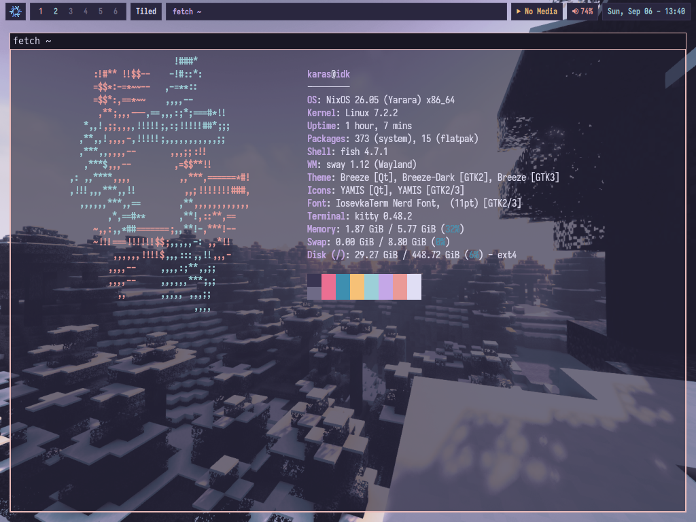
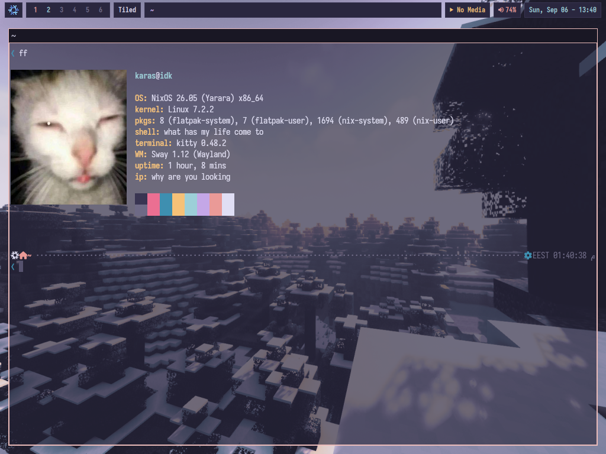

# sway-quickshell-config

## it is a fork from the quickshell config tony-btw built and I made it rose pine moon and changed a bunch of stuff in the bar anyway to install it run
<p align="center">
  
  
</p>

```bash
git clone https://github.com/Christine-oss-web/sway-quickshell-config-.git

# then unzip it

cd sway-quickshell-config- && unzip quickshell.zip -d .

# then delete/backup your old quickshell config (preferably backup)

# after copy the quickshell folder from the repo to ~/.config

cp -r quickshell ~/.config
